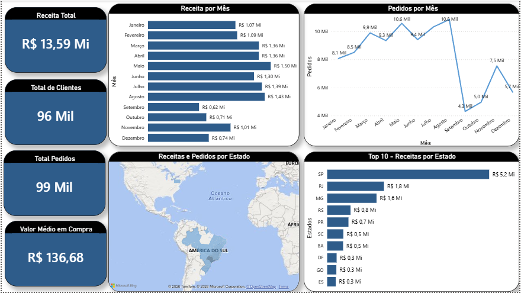
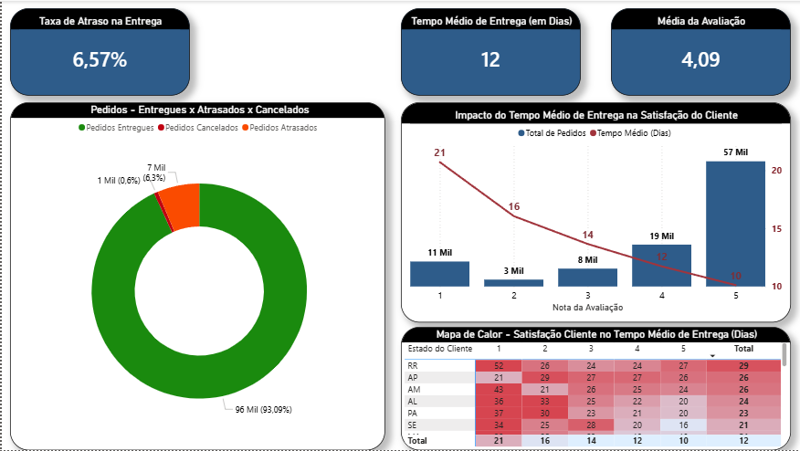
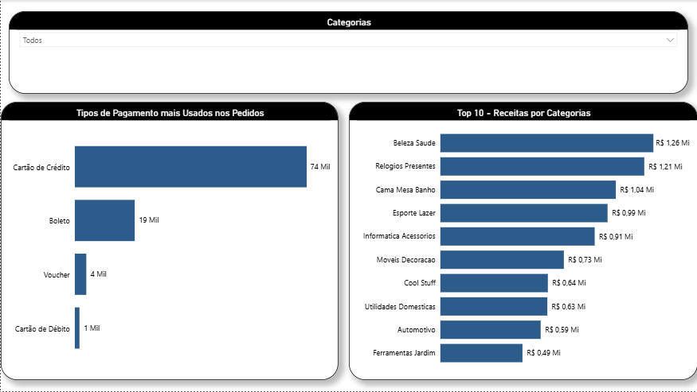

# 📊 Análise de Dados na Base Olist (E-commerce)

## 📝 Sobre o Projeto
Este projeto tem como objetivo realizar a extração, tratamento e modelagem de dados do e-commerce brasileiro **Olist**. 
A base original, composta por múltiplos arquivos transacionais, foi modelada em um *Star Schema* para permitir a criação de um Data Warehouse otimizado, servindo como fundação para a construção de dashboards analíticos em Power BI.

Os dados utilizados são públicos e foram disponibilizados através do [Kaggle](https://www.kaggle.com/datasets/olistbr/brazilian-ecommerce).

## 🛠️ Tecnologias Utilizadas
* **Banco de Dados:** Microsoft SQL Server
* **Ambiente de Desenvolvimento:** SQL Server Management Studio (SSMS)
* **Linguagem:** SQL (T-SQL)
* **Visualização de Dados:** Power BI

## ⚙️ Arquitetura e Modelagem de Dados
Os dados brutos foram importados, limpos e estruturados em **Views** para garantir a performance e a aplicação das regras de negócio diretamente no servidor (Pushdown). O modelo lógico foi dividido em Tabelas Fato e Dimensão (Star Schema):

### 📘 Tabelas Dimensão (Cadastros)
* `vw_dim_clientes`: Tratamento de identificadores, padronização de strings (`UPPER`, `TRIM`).
* `vw_dim_produtos`: Enriquecimento de dados através de `LEFT JOIN` para tradução de categorias e tratamento de valores nulos (`COALESCE`).
* `vw_dim_geolocalizacao`: Padronização de regiões.

### 📊 Tabelas Fato (Transações)
* `vw_fato_pedidos`: Fatiamento de Timestamps em `DATE` e `TIME` para controle logístico de aprovação, envio e entrega.
* `vw_fato_itens`: Tratamento de casas decimais e categorização temporal (`CASE WHEN` para meses e semestres).
* `vw_fato_pagamentos`: Consolidação de meios e parcelas de pagamento.
* `vw_fato_avaliacoes`: Tratamento do feedback do consumidor e índices de satisfação.

## 🚀 Principais Desafios Técnicos Solucionados
* **Data Cleansing:** Correção do formato monetário e separação correta de datas e horas que vieram unidas em formato string.
* **Internacionalização:** Relacionamento entre a base de produtos original e a tabela de tradução para suportar categorias em inglês.
* **Integridade de IDs:** Interpretação e separação das regras de negócio entre IDs de sessão de compra e identificadores únicos de contas de clientes.

## 👨‍💻 Autor
**Cauã Bonfim**
Estudante de Análise e Desenvolvimento de Sistemas na UERJ e Estagiário de TI.
